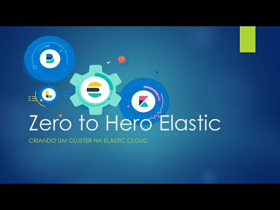

| [Home](https://techlipe.github.io/Workshop-Zero-To-Hero) | [Dia 01](https://techlipe.github.io/Workshop-Zero-To-Hero/dia01-configuracoes) | [Dia 02](https://techlipe.github.io/Workshop-Zero-To-Hero/dia02-observabilidade) | [Dia 03](https://techlipe.github.io/Workshop-Zero-To-Hero/dia03-elasticsearch) | [Dia 04](https://techlipe.github.io/Workshop-Zero-To-Hero/dia04-logstash) | [Dia 05](https://techlipe.github.io/Workshop-Zero-To-Hero/dia05-kibana) | 

# Workshop Elastic - Zero to Hero (Dia 1)
* **Criado por:** Anselmo Borges<br>
* **Última atualização:** 29.03.2020

[]

Nesse repositório estarão dispostos os arquivos necessários para configuração do ambiente, lembrando que vamos subir esse ambiente usando Google Cloud, o custo do mesmo é de responsabilidade do Aluno, estimo que a utilização do mesmo em umas 3 horas dará menos do que 10 reais, portanto lembre-se de excluir o ambiente depois de utilizado, caso contrário ele será cobrado enquanto ligado.

Nesse tutorial, vamos fazer uma instalação usando Docker, o que deixa o processo muito mais rápido e como nosso foco será mais na utilização do que na configuração da infra, acredito ser a melhor opção.

## Acessando o Google Cloud:
Para utilização do Google Cloud é necessário o uso de um Cartão de crédito, mas nada é debitado dele quando cadastrado, caso seja a sua primeira vez na plataforma, após o cadastro você ganha 300 dolares para usar na infra por 12 meses, sendo assim a criação dessa infra não terá custo.

Para acessar e fazer seu cadastro basta ter um email do gmail e entrar nesse link: 

https://cloud.google.com/

Acho que o processo de cadastro dura menos de 3 min e você já pode usar.

## Configuração do servidor:
Iremos criar um CentOS7 com 1VCPU, 3,75GB de RAM e 20GB de disco. Isso é mais do que o suficiente para nossos testes. Para criar sua maquina faça conforme vídeo abaixo (Clique na imagem para ver):

[](https://youtu.be/3PldhJq3ANc "Criação da infra no Google Cloud")

## Pré requisitos no S.O:
* Docker instalado
* Docker compose instalado
* Git instalado

## Instalando Pré-reqs
Para instalar todos os pré reqs citados acima rode os comandos abaixo:

```
sudo yum update -y
sudo yum install docker git -y
sudo curl -L "https://github.com/docker/compose/releases/download/1.25.3/docker-compose-$(uname -s)-$(uname -m)" -o /usr/local/bin/docker-compose
sudo chmod +x /usr/local/bin/docker-compose
sudo ln -s /usr/local/bin/docker-compose /usr/bin/docker-compose
```

Com tudo instalado validamos o docker compose:

```
docker-compose -version
```

## Ambiente do laboratório:
* ElasticSearch (versão 7.6.2 atualmente) - Onde serão inseridos os dados
* Kibana (versão 7.6.2 atualmente) - Onde serão dispostos os dashboards e faremos os ajustes do index.

## Docker compose
É um arquivo yml que vem com as configurações necessárias para subirmos esses dados em Docker para iniciarmos os trabalhos. Maiores detalhes sobre o conteudo dele, basta ver o vídeo abaixo.

## Baixando esse repositório via Git:
Para baixar o repositorio com o compose digite o comando abaixo:
```
git clone https://github.com/techlipe/Workshop-Zero-To-Hero.git
```
Entre dentro do diretório baixado:
```
cd Workshop-Zero-To-Hero
```

## Realize o start do deamon do Docker:
Por padrão o Docker não vem iniciado, sendo assim rodamos os comandos abaixo para iniciar o Docker:
```
sudo service docker start
```

## Como fazer a execução.
Com o docker e o docker-compose instalados (no meu caso num Linux) basta baixar esse conteudo via ```git clone``` e entrando na pasta baixada rodar o comando abaixo:

```
sudo docker-compose up -d
```

Não precisa passar o nome do arquivo pois ele considera que já está no diretório corrente e certifique-se disso, rs. O conteudo de cada uma das imagens será baixado o que pode demorar um pouco, mas estando tudo no ar basta acessar no navegador com ```http://localhost:portas_abaixo```:
* Elasticsearch - Porta 9200
* Kibana - Porta 5601
  
## Monitorando o start dos serviços:
Podemos acompanhar os logs de inicialização de cada serviço com o comando abaixo:
```
sudo docker-compose logs -f
```
Caso haja alguma duvida, segue o link do vídeo com toda essa implantação passo a passo. Clique na imagem!
[](https://youtu.be/aV1euh4B4XE "Instalação do Elasticsearch e Kibana via Docker")

## Criação de Cluster no Elastic Cloud:
Uma outra opção, simples, rápida e eficiente é subir o seu Cluster no ambiente Elastic Cloud, que já vem configurado da maneira adequada, ajustavel de acordo com a sua necessidade, trabalha na infra cloud de sua preferencia (Amazon AWS, Google GCP e Microsoft Azure), e tem um trial de 14 dias sem necessidade de cartão de crédito, somente a conta de email.

O Cluster já vem como todas as ferramentas da versão licenciada, como Machine Learning, Grafos, Watcher e outras além de já vir com TLS e Autenticação ativada, ou seja, você chega a ganhar alguns dias de implantação no que diz respeito a velocidade.

No vídeo abaixo eu explico como criar a conta trial e subir um cluster básico na infra Elastic Cloud. (Clique na imagem para abrir!)

[](https://youtu.be/m-aLIWEZyvU "Criação de um cluster na Elastic Cloud")

## Material Adicional:
Abaixo, mais algumas possibilidades de instalações que podem auxiliar no caso de não conseguirem o acesso ao Google GCP.

### Instalação do Elasticsearch e Kibana no Windows:
Para fazer o download do ElasticSearch para Windows clique no link abaixo:
https://www.elastic.co/guide/en/elasticsearch/reference/current/windows.html

Para fazer o Download do Kibana, segue o link abaixo para o Download:
https://artifacts.elastic.co/downloads/kibana/kibana-7.6.2-windows-x86_64.zip

Nesse vídeo abaixo explico como realizar a instalação do Elasticsearch e Kibana no Windows (O que eu não recomendo, rs).
link do video

[](https://youtu.be/YHra49modNA "Instalação do Elasticsearch e Kibana no Windows")

## Instalação do Docker e Git no Windows:
Pra que não conseguir criar uma conta no Google Cloud, uma opção é realizar a instalação via Docker no Windows, lembrando que o recomendado para melhor acompanhamento dos dias de treinamento é fazer no Google Cloud.

Segue abaixo os links de cada um dos Downloads:
* Docker para Windows - https://download.docker.com/win/stable/Docker%20Desktop%20Installer.exe
* Git - https://github.com/git-for-windows/git/releases/download/v2.26.0.windows.1/Git-2.26.0-64-bit.exe

**Observação:** Para que você consiga instalar o Docker no Windows, seu Windows precisa ser 10 nas versões PRO ou Enterprise, caso contrário ele não instala.
