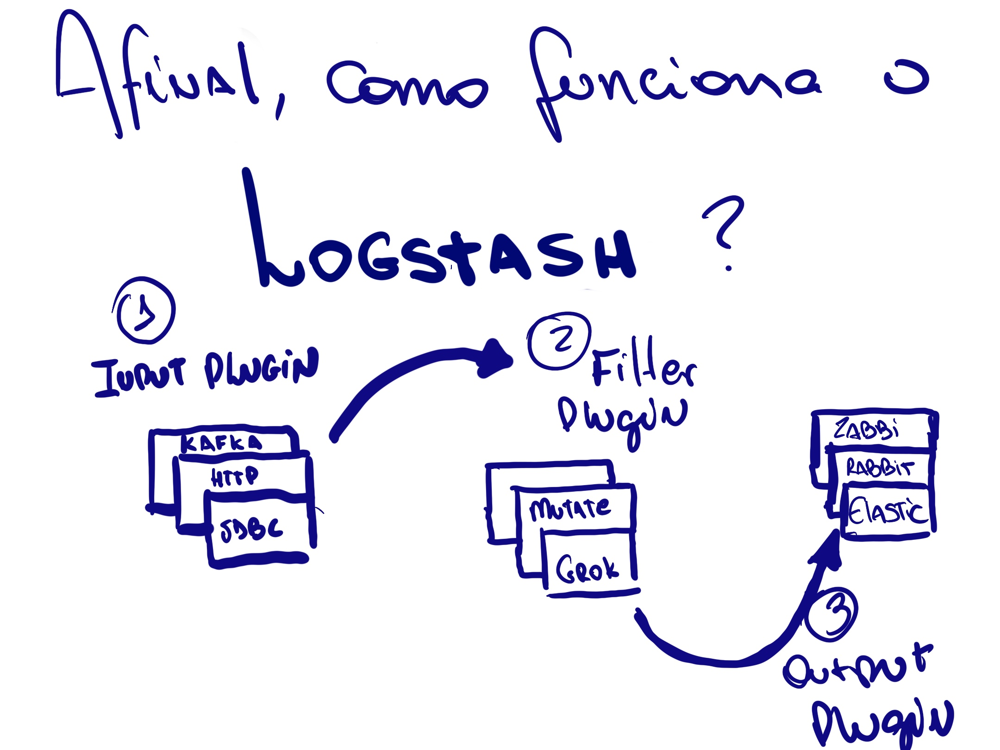
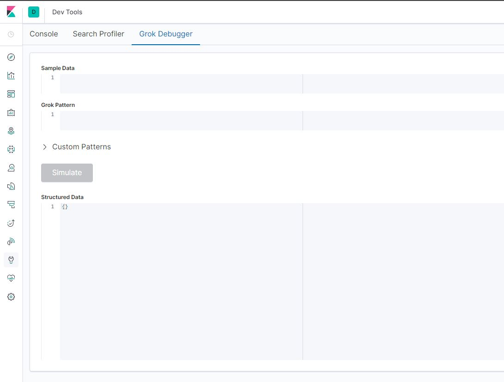
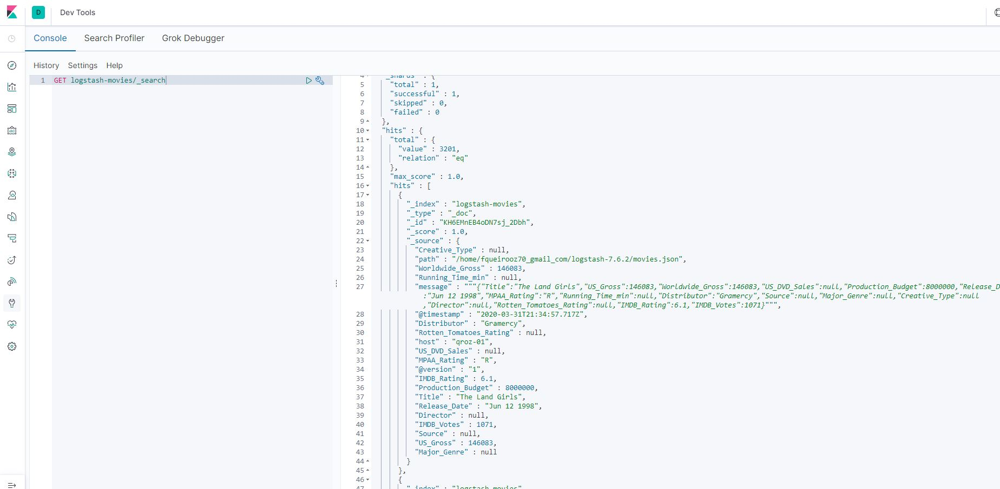

| [Home](https://techlipe.github.io/Workshop-Zero-To-Hero) | [Dia 01](https://techlipe.github.io/Workshop-Zero-To-Hero/dia01-configuracoes) | [Dia 02](https://techlipe.github.io/Workshop-Zero-To-Hero/dia02-observabilidade) | [Dia 03](https://techlipe.github.io/Workshop-Zero-To-Hero/dia03-elasticsearch) | [Dia 04](https://techlipe.github.io/Workshop-Zero-To-Hero/dia04-logstash) | [Dia 05](https://techlipe.github.io/Workshop-Zero-To-Hero/dia05-kibana) | 

# Workshop Elastic - Zero to Hero (Dia 4)
* **Criado por:** Felipe Queiroz <br>
* **Última atualização:** 01.04.2020

"[](images/dia01-instalacaoeambiente/Slide1.jpg)

Fala pessoal! Sejam muito bem vindos ao nosso Dia 04 de Workshop de Zero to Hero com toda a Elastic Stack. Hoje vimos como funciona o logstash e os pipelines de ingestão de dados. Antes de começar a seguir o nosso tutorial não esqueça de baixar o dataset de filmes no repositorio git do Workshop ;)


## Instalando o Logstash no Servidor local
**Instalar o Java no SO**
```
sudo yum install java -y
```

**Validar instalação do Java**
```
java -version
openjdk version "1.8.0_242"
OpenJDK Runtime Environment (build 1.8.0_242-b08)
OpenJDK 64-Bit Server VM (build 25.242-b08, mixed mode
```

**Baixar e descompactar o pacote do logstash (Atenção ao usuário que está utilizando no SO!)**
```
curl -L -O https://artifacts.elastic.co/downloads/logstash/logstash-7.6.2.tar.gz
sudo tar -xzvf logstash-7.6.2.tar.gz
chown -R usuariodoso:grupo logstash-7.6.2
```
**Confirmar se obteve sucesso validando a estrutura abaixo**
```
[@logstash-7.6.2]# ls -ltr logstash-7.6.2
total 524
-rw-r--r--. 1 631 503 480537 Mar 26 08:51 NOTICE.TXT
-rw-r--r--. 1 631 503   2276 Mar 26 08:51 CONTRIBUTORS
-rw-r--r--. 1 631 503  13675 Mar 26 08:51 LICENSE.txt
drwxr-xr-x. 2 631 503      6 Mar 26 08:51 data
-rw-r--r--. 1 631 503   4028 Mar 26 08:53 Gemfile
-rw-r--r--. 1 631 503  22676 Mar 26 08:53 Gemfile.lock
drwxr-xr-x. 4 631 503     33 Mar 26 09:42 vendor
drwxr-xr-x. 9 631 503    193 Mar 31 20:24 x-pack
drwxr-xr-x. 4 631 503     55 Mar 31 20:24 modules
drwxr-xr-x. 6 631 503     84 Mar 31 20:24 lib
drwxr-xr-x. 3 631 503     86 Mar 31 20:24 logstash-core-plugin-api
drwxr-xr-x. 4 631 503     90 Mar 31 20:24 logstash-core
drwxr-xr-x. 2 631 503    142 Mar 31 20:24 config
drwxr-xr-x. 2 631 503   4096 Mar 31 20:24 bin
drwxr-xr-x. 3 631 503     30 Mar 31 20:24 tools
```

### Um pouco de teoria
Logstash é uma aplicação java que faz um papel de um ETL (Extract, transform, load) na Stack. O mesmo tem um grande potencial de tratar grandes volumes de dados de diferentes origens. Cada processo dentro do logstash é chamado de _pipeline_.

Dentro de cada _pipeline_ teremos um arquivo de configuração que será associado que pode ser divido em 3 seções, sendo elas **Input, Filter e Output**, de maneira bem intuitiva carrega os dados de alguma fonte, processa (ou não) esses dados e por final "despeja" em algum datasource.

Em cada uma de suas seções temos uma grande variedade de plugins disponíveis que possibilitam conexões em bancos relacionais, brokers, aplicações REST e transformação desses dados de várias formas.




## Primeiro laboratorio, como funciona o plugin de filtro Grok Debugger!
**Criando um arquivo log de Exemplo** 
```
cd logstash-7.6.2
echo "[2020–04–09] INFO MensagemdoLOG: You Know for Search" > exemplo.log
```

**Criando o primeiro pipeline**
```
mkdir pipelines
vi pipelines/meupipeline.conf
```

**Conteudo do arquivo meupipeline.conf**
```
input {

  file {
     path => "${PWD}/exemplo.log"
     start_position => "beginning"
     sincedb_path => "/dev/null"
   }

}


filter {

}


output {
  stdout {}
}
```

Observações: Plugins utilizados file (input) que busca informações em um arquivo e é controlado pelo ponteiro no sincedb_path, e stdout (output) um simples print de como foi processado o arquivo lido.

**Inicializar o Serviço passando o arquivo de configuração por parâmetro**
```
bin/logstash -f pipelines/meupipeline.conf
```

**Resultado Esperado!**
```
{
    "@timestamp" => 2020-03-31T20:57:26.549Z,
       "message" => "[2020–04–09] INFO MensagemdoLOG: You Know for Search",
          "host" => "qroz-01",
          "path" => "logstash-7.6.2/exemplo.log",
      "@version" => "1"
}
```

## Utilizando o Grok Debugger para processar dados não estruturados
Antes de começarmos vale lembrar que o Grok Debugger é um plugin de filtro que possibilita que transformemos um log despadronizado em um documento no formato json que pode ser indexado e futuramente buscado em campos no Elasticsearch.

**Acessar a console do Kibana > Dev Tools > Grok Debugger**

**Em sample data colocar o trecho abaixo:**
```
[2020–04–09] INFO MensagemdoLOG: You Know for Search
```
**O pattern que utilizamos foi:**
```
\[%{DATA:timestamp}\] %{WORD:loglevel} MensagemdoLOG\: %{GREEDYDATA:logmessage}
```
**Resultado esperado:**
```
{
  "loglevel": "INFO",
  "logmessage": "You Know for Search",
  "timestamp": "2020–04–09"
}
```
**Vamos implementar em nosso pipeline** 
```
vi pipelines/meupipeline.conf
```
**Arquivo final (meupipeline.conf) do laboratorio de GROK**
```
input {

  file {
     path => "${PWD}/exemplo.log"
     start_position => "beginning"
     sincedb_path => "/dev/null"
   }

}

filter {
  grok {
        match => {
          "message" => "\[%{DATA:timestamp}\] %{WORD:loglevel} MensagemdoLOG\: %{GREEDYDATA:logmessage}"
        }
      }
}


output {
  stdout {}
  elasticsearch  {
     hosts => ["http://localhost:9200"]
     index => "grokando"
  }
}
```
**Obs: Melhores práticas de uso de pipelines**

Para melhor utilização de recursos e termos também a possibilidade de iniciarmos varios pipelines sem necessariamente iniciarmos varios processos, é recomendado que seja utilizado o arquivo config/pipelines.yml para declarar quais pipelines você utilizará naquela instância de logstash.

O arquivo é lido automaticamente quando não é passado nenhum parâmetro como o '-f' com referências a arquivos de configuração.
```
cat config/pipelines.yml  
```

# Segundo laboratorio, consumindo um dataset de filmes json (arquivo de configuração disponivel no github)

## Realizando configurações iniciais

**Indexar mapeamento do nosso índice final no Kibana > Dev Tools**
```
PUT logstash-movies/
{
  "mappings": {
    "properties": {
  "adult": {
    "type": "keyword"
  },
  "belongs_to_collection": {
    "type": "text"
  },
  "budget": {
    "type": "long"
  },
  "genres": {
    "type": "text",
    "fields" : {
      "keyword" : {
        "type" : "keyword"
      }
    }
  },
  "homepage": {
    "type": "text",
    "fields" : {
      "keyword" : {
        "type" : "keyword"
      }
    }
  },
  "id": {
    "type": "long"
  },
  "imdb_id": {
    "type": "keyword"
  },
  "original_language": {
    "type": "text",
    "fields" : {
      "keyword" : {
        "type" : "keyword"
      }
    }
  },
  "original_title": {
    "type": "text",
    "fields" : {
      "keyword" : {
        "type" : "keyword"
      }
    }
  },
  "overview": {
    "type": "text",
    "fields" : {
      "keyword" : {
        "type" : "keyword"
      }
    }
  },
  "popularity": {
    "type": "double"
  },
  "poster_path": {
    "type": "keyword"
  },
  "production_companies": {
    "type": "text",
    "fields" : {
      "keyword" : {
        "type" : "keyword"
      }
    }
  },
  "production_countries": {
    "type": "text",
    "fields" : {
      "keyword" : {
        "type" : "keyword"
      }
    }
  },
  "release_date": {
    "type": "date",
    "format": ["yyyy-MM-dd"]
  },
  "revenue": {
    "type": "long"
  },
  "runtime": {
    "type": "long"
  },
  "spoken_languages": {
    "type": "text",
    "fields" : {
      "keyword" : {
        "type" : "keyword"
      }
    }
  },
  "status": {
    "type": "text",
    "fields" : {
      "keyword" : {
        "type" : "keyword"
      }
    }
  },
  "tagline": {
    "type": "text",
    "fields" : {
      "keyword" : {
        "type" : "keyword"
      }
    }
  },
  "title": {
    "type": "text",
    "fields" : {
      "keyword" : {
        "type" : "keyword"
      }
    }
  },
  "video": {
    "type": "boolean"
  },
  "vote_average": {
    "type": "double"
  },
  "vote_count": {
    "type": "long"
  }
}
    }
  }
```
**Copiar o arquivo movies.json para a home do logstash (pode ser feito através do gitclone do repositorio do workshop)**
```
cd ~
git clone https://github.com/techlipe/Workshop-Zero-To-Hero.git
cp Workshop-Zero-To-Hero/dataset/movies.json logstash-7.6.2/ 
```

**Para validar, o resultado deve ser igual o abaixo**
```
head -1 logstash-7.6.2/movies.json 
{"adult":"False","belongs_to_collection":"{'id': 10194, 'name': 'Toy Story Collection', 'poster_path': '/7G9915LfUQ2lVfwMEEhDsn3kT4B.jpg', 'backdrop_path': '/9FBwqcd9IRruEDUrTdcaafOMKUq.jpg'}","budget":"30000000","genres":"[{'id': 16, 'name': 'Animation'}, {'id': 35, 'name': 'Comedy'}, {'id': 10751, 'name': 'Family'}]","homepage":"http://toystory.disney.com/toy-story","id":"862","imdb_id":"tt0114709","original_language":"en","original_title":"Toy Story","overview":"Led by Woody, Andy's toys live happily in his room until Andy's birthday brings Buzz Lightyear onto the scene. Afraid of losing his place in Andy's heart, Woody plots against Buzz. But when circumstances separate Buzz and Woody from their owner, the duo eventually learns to put aside their differences.","popularity":"21.946943","poster_path":"/rhIRbceoE9lR4veEXuwCC2wARtG.jpg","production_companies":"[{'name': 'Pixar Animation Studios', 'id': 3}]","production_countries":"[{'iso_3166_1': 'US', 'name': 'United States of America'}]","release_date":"1995-10-30","revenue":373554033,"runtime":81,"spoken_languages":"[{'iso_639_1': 'en', 'name': 'English'}]","status":"Released","tagline":"","title":"Toy Story","video":false,"vote_average":7.7,"vote_count":5415}
```
**Implementando a primeira versão do pipeline**
```
cd logstash-7.6.2
vi pipelines/movies.conf
```
**primeira versão do movies.conf**
```
input {

  file {
     path => "${PWD}/movies.json"
     sincedb_path => "/dev/null"
     start_position => "beginning"
  }

}


filter {

   json {
     source => "message"
   }

}


output {

stdout {}

}
```
Obs: Os plugin novo utilizado é o **json** que é responsavel por interpretar um determinado campo e fazer o split supondo que o conteúdo desse campo é um json.

**Alterando pipelines.yml e iniciando o primeiro teste**
```
vi config/pipelines.yml
```
**Adicionar o seguinte conteúdo em pipelines.yml**
```
- pipeline.id: movies
  path.config: "${PWD}/pipelines/movies.conf"
```
**Iniciar o serviço sem parâmetro**
```
bin/logstash
```
Observação: Reparar que o campo timestamp está com o valor padrão (horário que o logstash gerou o evento)

**Implementando o Plugin Date e indexando no Elasticsearch**
```
input {
 file {
     path => "${PWD}/movies.json"
     start_position => "beginning"
     sincedb_path => "/dev/null" 
}
}

filter {
   
    json {

      source => "message"
    }
 
    date {

      match => [ "release_date" , "yyyy-MM-dd" ]
      target => "@timestamp" 
    }

}


output {

 stdout { }
 elasticsearch {
   index => "logstash-movies"
 }
}

```
**Iniciar o serviço sem parâmetro**
```
bin/logstash
```

**Para validar, acesse a console do Kibana e ir em Dev Tools e rodar o comando GET abaixo:**
```
GET logstash-movies/_search
```
**Validando via API o resultado**


