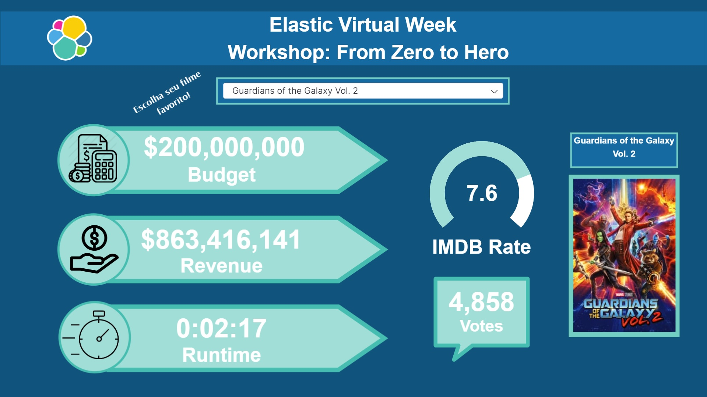

| [Home](https://techlipe.github.io/Workshop-Zero-To-Hero) | [Dia 01](https://techlipe.github.io/Workshop-Zero-To-Hero/dia01-configuracoes) | [Dia 02](https://techlipe.github.io/Workshop-Zero-To-Hero/dia02-observabilidade) | [Dia 03](https://techlipe.github.io/Workshop-Zero-To-Hero/dia03-elasticsearch) | [Dia 04](https://techlipe.github.io/Workshop-Zero-To-Hero/dia04-logstash) | [Dia 05](https://techlipe.github.io/Workshop-Zero-To-Hero/dia05-kibana) | 

# Workshop Elastic - Zero to Hero (Dia 5)
* **Criado por:** Felipe Queiroz e Anselmo Borges <br>
* **Última atualização:** 10.04.2020

https://www.youtube.com/watch?v=ucPmeX8Zx-Y&t=3903s


[](images/dia01-instalacaoeambiente/Slide1.jpg)

O tutorial de hoje será um pouco diferente, vamos seguir 100% pelo vídeo para realizar a construção dos dashboards no Kibana tradicional e no Kibana Canvas.

A documentação consistira no vídeo (que colocaremos aqui nessa página assim que acabar o evento) e nas configurações de alguns campos.

## Kibana Canvas Lab

**Observações: As imagens para os icones laterais estão no repositorio https://github.com/techlipe/Workshop-Zero-To-Hero/ na pasta images/canvaslab**

**Código do Markdown do poster do filme**

```
{{#each rows}}

{{/each}}
```

**Código do Markdown do titutlo do filme**

```
{{#each rows}}
{{title}}
{{/each}}
```

**Cores Utilizadas**

```
Background -  #10537D
Barra superior - #156BA1
Letras Superiores - BRANCO
Seta - fill (#a1ded7) border(#45bdb0)
Square dos Filmes - fill (#72cec3)
```

**Resultado Final** 



**Parabéns a você que realizou tudo até aqui :)**
